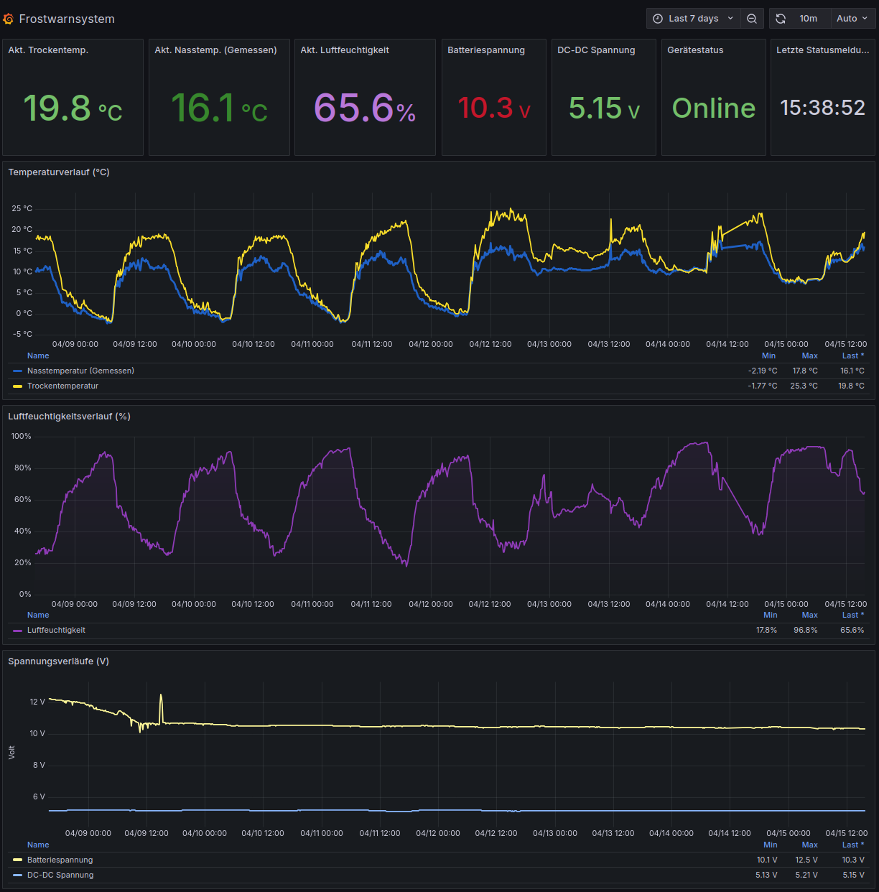
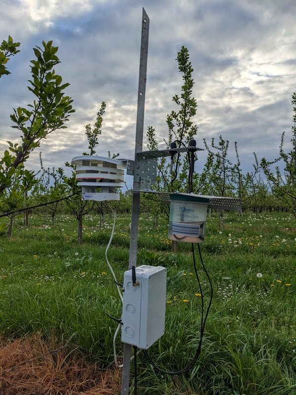

# MQTT-Based Frost Warning System with Cellular Connectivity

[](https://opensource.org/licenses/MIT)

## Introduction

This project implements a remote environmental monitoring system designed primarily for frost warnings in agricultural settings like orchards. It utilizes a Raspberry Pi Zero 2 W equipped with temperature/humidity sensors and a SIM800L cellular modem to collect data and transmit it via MQTT over a GPRS connection. Data is received by a home server, processed by Node-RED, stored in InfluxDB, and visualized using Grafana dashboards. Remote access for maintenance is provided via a persistent reverse SSH tunnel.




## Motivation

This project was developed out of a practical need to monitor temperatures and provide timely frost warnings for a family-run orchard growing plums, cherries, and pears. The orchard utilizes a frost irrigation system (sprinklers), and knowing the precise wet bulb temperature is crucial for deciding when to activate the system to prevent crop damage during critical frost events.

Beyond the practical application, this project served as a valuable learning experience, exploring the integration of various technologies common in IoT (Internet of Things) systems:

*   Interfacing hardware sensors (Temperature, Humidity, Voltage) with a Raspberry Pi.
*   Establishing reliable internet connectivity in a remote location using cellular GPRS modules (`SIM800L`) and the Point-to-Point Protocol (`ppp`).
*   Utilizing the lightweight MQTT protocol for efficient data transmission over potentially unstable networks.
*   Implementing server-side data aggregation and storage using Node-RED and InfluxDB.
*   Visualizing time-series data effectively with Grafana dashboards.
*   Setting up secure remote access to a headless device behind Carrier-Grade NAT using reverse SSH tunnels.
*   Managing system services and ensuring reliability with `systemd` and watchdog scripts.

## Features

*   **Sensor Monitoring:** Reads Dry Bulb (DS18B20), Wet Bulb (DS18B20 with wet shoelace), Humidity (DHT22), Battery Voltage and DC-DC Converter Output Voltage (ADS1115 via voltage divider).
*   **Calculations:** Calculates Wet Bulb Temperature (approximation), Battery Percentage.
*   **Cellular Connectivity:** Establishes and maintains a GPRS internet connection using `ppp`. Includes watchdog service for modem/connection reliability.
*   **MQTT Communication:** Publishes sensor data and system status (online/offline via LWT) to an MQTT broker using Paho MQTT.
*   **Data Buffering:** Temporarily stores sensor data locally if MQTT connection is lost and sends it when reconnected.
*   **Server-Side Processing:** Node-RED flow subscribes to MQTT topics, formats data (using Line Protocol), and writes to InfluxDB via its HTTP API.
*   **Time-Series Database:** InfluxDB v2 stores sensor readings and device status.
*   **Visualization:** Grafana dashboard displays current readings, historical trends, and system status.
*   **Remote Access:** Secure remote SSH access to the Pi Zero via a persistent reverse SSH tunnel managed by `autossh`.
*   **Alerting:** Alert rules configured in the local Grafana instance send notifications to Grafana Cloud, which then pushes alerts to users via the Grafana IRM mobile app based on escalation chains. (SMS alerts via Pi are disabled due to serial port conflict with `ppp`).

## Hardware Components

*   Raspberry Pi Zero 2 W (or similar)
*   SIM800L V2.0 GSM/GPRS Module (with antenna)
*   SIM Card for mobile data (Tested with Netzclub and Telekom Germany SIM Cards)
*   2x DS18B20 Temperature Sensors (one with a wet shoelace)
*   DHT22 Temperature & Humidity Sensor
*   ADS1115 ADC Module (for voltage readings)
*   Appropriate Battery (e.g., 12V Lead Acid) & Power Supply/Charging Circuit
*   DC-DC Converter (if needed for Pi/Sensor power)
*   Pull-up Resistors for Sensors and Resistors for Voltage Divider (for ADS1115 inputs)
*   Connecting Wires, Enclosure, etc.

**(See `hardware/schematic.png` (TBD) for circuit diagram)**

Here's a look at the assembled sensor node:



## Software & Technologies

**Sensor Node (Pi Zero):**

*   Raspberry Pi OS Lite (32-bit, Debian based)
*   Python 3
*   Paho-MQTT
*   pySerial (used by `ppp` check, potentially by other libs)
*   Adafruit Blinka & PlatformDetect
*   Adafruit CircuitPython Libraries (DHT, ADS1x15)
*   RPi.GPIO
*   psutil
*   `ppp` package
*   `autossh` package
*   `systemd` (for services)

**Server:**

*   Raspberry Pi OS (64-bit) or Ubuntu Linux (or other Linux distro)
*   Mosquitto MQTT Broker
*   Node-RED
*   InfluxDB v2.x
*   Grafana
*   Caddy Web Server (Optional, for easy TLS/HTTPS reverse proxy)
*   OpenSSH Server
*   `systemd`

**Protocols:**

*   MQTT (v3.1.1 or v5)
*   PPP
*   GPRS/EDGE
*   TCP/IP
*   SSH
*   HTTP/HTTPS (for Grafana, InfluxDB API)

## System Architecture


*(**TODO:** Create and add an architecture diagram image named `architecture_placeholder.png` to the `hardware` directory)*

**Data Flow:** Sensors -> Python Script (`frost_warning_mqtt.py`) -> `ppp0` Interface -> Cellular Network -> Internet -> Home Router (Port Forward) -> [Optional: Caddy (TLS Termination on 8883)] -> Mosquitto (Port 1883) -> Node-RED -> InfluxDB API Write -> InfluxDB Database -> Grafana

**Remote Access:** Pi Zero (`autossh` service) -> `ppp0` Interface -> Cellular Network -> Internet -> Home Router (Port Forward for SSH) -> Home Server (SSHd on Port 22) <- You (SSH Client connecting to Home Server on Tunnel Port, e.g., 22022)

## Setup & Configuration

**Note:** These instructions assume familiarity with Linux command line, Raspberry Pi setup, and basic networking. Use the `.example` files and replace placeholders. **Security is your responsibility.**

**A. Sensor Node (Raspberry Pi Zero)**

1.  **OS Setup:** Install Raspberry Pi OS Lite (32-bit recommended for Pi Zero). Configure basic settings (hostname, locale, timezone). Enable **SSH**, **I2C**, and **Serial Port Hardware** (but **disable** serial login console) using `sudo raspi-config`.
2.  **Hardware:** Connect sensors, modem, power according to the schematic in `hardware/`. Ensure SIM card is inserted and functional (PIN unlocked if required).
3.  **Clone Repo:** `git clone https://github.com/blakeyy/frost-warning-system.git` and `cd frost-warning-system/sensor_node`
4.  **Dependencies & Virtual Environment:**
    *   It is **strongly recommended** to use a Python virtual environment to manage dependencies.
    *   **Install system packages:**
        ```bash
        sudo apt update
        sudo apt install ppp autossh python3-pip python3-venv git coreutils -y
        ```
    *   **Navigate to the sensor node directory** (if not already there):
        ```bash
        cd /path/to/frost-warning-system/sensor_node
        ```
    *   **Create virtual environment:**
        ```bash
        python3 -m venv sensor_env
        ```
    *   **Activate virtual environment:**
        ```bash
        source sensor_env/bin/activate
        ```
        *(Your shell prompt should now show `(sensor_env)` at the beginning)*
    *   **Install Python packages:**
        ```bash
        pip install -r requirements.txt
        ```
    *   *(Remember to activate the environment (`source sensor_env/bin/activate`) in any new terminal session where you want to run the scripts manually)*
5.  **Configure PPP:**
    *   Copy example files: `sudo cp ppp/peers/gprs.example /etc/ppp/peers/gprs` and `sudo cp ppp/chatscripts/gprs.example /etc/chatscripts/gprs`.
    *   **Edit `/etc/chatscripts/gprs`:** Ensure the `AT+CGDCONT` line uses the correct APN for your provider (e.g., `internet.telekom`). Verify the `ATD*99#` command is appropriate.
    *   **Edit `/etc/ppp/peers/gprs`:** Verify serial port (`/dev/ttyS0`), baud rate (e.g., `9600` or `115200` - must match modem), and options. Ensure `noauth` is present (if required), DNS options (`ms-dns` or `usepeerdns`) are correct for reliable name resolution, and `nodetach` is commented out for service operation. Ensure `crtscts` is present if hardware flow control is needed.
    *   **Set Permissions:** `sudo chmod 600 /etc/ppp/peers/gprs /etc/chatscripts/gprs`
    *   **Test manually:** Run `sudo pon gprs`, check logs (`/var/log/ppp-gprs.log`), check `ip addr`, `ip route`, and `ping 8.8.8.8`, `ping google.com`. Stop with `sudo poff gprs`.
6.  **Configure Frost Warner Script:**
    *   `cp frost_config_mqtt.json.example frost_config_mqtt.json`
    *   **Edit `frost_config_mqtt.json`:** Fill in **YOUR** `mqtt_broker` (DDNS name), `mqtt_port` (e.g., 1883 or 8883 for TLS), `mqtt_username`, `mqtt_password`. Review other settings like `warning_temp`, check intervals.
7.  **Configure SSH Tunnel:**
    *   Generate SSH keys on the Pi: `ssh-keygen -t rsa -b 4096` (accept defaults, **no passphrase**).
    *   Copy public key to your server: `ssh-copy-id YOUR_SERVER_USER@YOUR_SERVER_DDNS` (enter server password once).
    *   Test passwordless login from Pi to server: `ssh YOUR_SERVER_USER@YOUR_SERVER_DDNS` then `exit`.
8.  **Configure Services:**
    *   Copy example service files: `sudo cp services/*.example /etc/systemd/system/`
    *   Rename by removing `.example`: `sudo systemctl rename /etc/systemd/system/autossh-rev-tunnel.service.example autossh-rev-tunnel.service` (Repeat for `ppp-gprs`, `frostwarn`, `sim800l-watchdog`).
    *   **Edit `/etc/systemd/system/autossh-rev-tunnel.service`:** Replace placeholders: `YOUR_TUNNEL_PORT`, `YOUR_SERVER_USER@YOUR_SERVER_DDNS`. Ensure `User=pi` (or your login user) is correct.
    *   **Edit `/etc/systemd/system/frostwarn.service`:** Ensure the `User=` is correct. **Crucially, update the `ExecStart=` path** to use the Python interpreter inside your virtual environment: `ExecStart=/path/to/sensor_env/bin/python /path/to/frost_warning_mqtt.py`. Use absolute paths (e.g., `/home/pi/frost-warning-system/sensor_node/sensor_env/bin/python ...`).
    *   **Edit `/etc/systemd/system/sim800l-watchdog.service`:** Update `User=` and `ExecStart=` path similarly to use the virtual environment's Python.
    *   Enable services to start on boot:
        ```bash
        sudo systemctl enable ppp-gprs.service
        sudo systemctl enable autossh-rev-tunnel.service
        sudo systemctl enable frostwarn.service
        sudo systemctl enable sim800l-watchdog.service # Recommended for cellular reliability
        ```
9.  **Configure Log Rotation (Optional but Recommended):**
    *   Copy the example logrotate configuration to the system directory:
        ```bash
        sudo cp logrotate-pi.conf.example /etc/logrotate.d/frostwarner
        ```
    *   Verify the log file paths inside `/etc/logrotate.d/frostwarner` match the actual locations used by your scripts and ppp.
    *   Logrotate typically runs daily via cron.
10. **Reboot:** `sudo reboot`. The system should now attempt to connect via Wi-Fi first, then cellular, start the MQTT script, the watchdog, and the SSH tunnel.

**B. Server Setup**

1.  **Install Software:** Install Mosquitto, InfluxDB v2, Node-RED, Grafana, Caddy (optional), OpenSSH Server. Refer to official documentation for installation on your server's OS.
2.  **Configure Mosquitto:**
    *   Use the example files in `/server_setup/mosquitto/` as a guide. Ensure `allow_anonymous false` and `password_file` are set in the main config. Use the `listener 1883 localhost` configuration in `conf.d/` if using Caddy for TLS, or `listener 1883 0.0.0.0` if exposing 1883 directly (less secure).
    *   Create MQTT user/password: `sudo mosquitto_passwd -c /etc/mosquitto/passwd YOUR_MQTT_USER` (set a strong password).
    *   Set permissions: `sudo chown mosquitto:mosquitto /etc/mosquitto/passwd && sudo chmod 600 /etc/mosquitto/passwd`.
    *   Restart Mosquitto: `sudo systemctl restart mosquitto`.
3.  **Configure InfluxDB:**
    *   Follow instructions in `/server_setup/influxdb/setup_notes.md` to create Org, Bucket, API Token.
4.  **Configure Node-RED:**
    *   Start Node-RED (`node-red-start` or via `systemd` service). Access the editor (`http://<server-ip>:1880`).
    *   Go to **Menu -> Import** and paste the contents of `/server_setup/node-red/frost_warning_flow.json`.
    *   **Important:** After importing, you **must** edit the following nodes:
        *   **`change` Node ("Set InfluxDB Headers"):** Double-click the node. In the rule that sets `msg.headers`, replace `"Token PLACEHOLDER_INFLUXDB_API_TOKEN"` with your actual InfluxDB API Token inside the quotes (e.g., `"Token YourCopiedTokenString"`).
        *   **`http request` Node ("Write to InfluxDB"):** Double-click the node. In the **URL** field, replace `ExampleOrg` with your actual InfluxDB Organization name and `ExampleBucket` with your actual InfluxDB Bucket name (e.g., `FrostDataBucket`).
        *   **`mqtt in` Nodes ("MQTT Sensors In", "MQTT Status In"):** Double-click each. Edit the "Server" configuration (`Local Mosquitto`). Ensure Server is `localhost`, Port is `1883`. Go to the **Security** tab and enter the MQTT username and password you created. Click Update/Done.
    *   Click "Done" on each edited node and then "Deploy" the flow.
5.  **Configure Caddy (Optional, Recommended for TLS):**
    *   Use `/server_setup/caddy/Caddyfile.example` as a base. Replace placeholders like `mqtt.yourdomain.com` with your actual, publicly resolvable domain/subdomain name that points to your home IP.
    *   Ensure the `reverse_proxy` directive points to `localhost:1883`.
    *   Reload Caddy: `sudo systemctl reload caddy`. Check logs for errors.
6.  **Configure Router Port Forwarding:**
    *   Forward **TCP Port 8883** (if using Caddy/TLS for MQTT) to your server's internal IP, port 8883. **Do NOT forward port 1883 if using TLS.**
    *   Forward **TCP Port 22** (or your custom SSH port) to your server's internal IP (needed for the reverse tunnel target and direct server access).
    *   Forward **TCP/UDP Port for Caddy's HTTP/HTTPS** (usually 80/443) if Caddy is serving Grafana or handling ACME challenges, pointing to the server's internal IP.
7.  **Configure Grafana:**
    *   Access Grafana UI (`http://<server-ip>:3000` or your Caddy domain for Grafana).
    *   Log in (default admin/admin, change password).
    *   Add InfluxDB Data Source: Use Flux, Server URL (`http://localhost:8086`), Org name, Bucket name (`FrostDataBucket`), API Token (configure via `Authorization: Token ...` HTTP Header is recommended). Test connection.
    *   Import Dashboard: Click "+" -> Import -> Upload JSON file -> Select `/server_setup/grafana/Frostwarnsystem-Dashboard.json`. Link to your InfluxDB data source when prompted.
    *   **Configure Alerting (Existing Setup):** This project utilizes Grafana's built-in alerting features, forwarding alerts to a Grafana Cloud instance for mobile push notifications via Grafana IRM.
        *   Ensure your local Grafana instance has a configured a Grafana OnCall Contact point (under Alerts & IRM -> Alerting -> Contact points) with your Grafana Cloud (see Grafana documentation for details on setting this up).
        *   Define Alert Rules within the local Grafana Dashboard (under Alerts & IRM -> Alerting -> Alert rules) based on queries against the InfluxDB data (e.g., `wet_temp` below threshold, `battery_percent` low, device status `offline`).
        *   Configure Escalation Chains and Notification Policies within your Grafana Cloud instance as needed to route alerts to the correct users or Grafana IRM app instances.

## SMS-Only Operation (Alternative)

This repository also includes a previous version of the sensor script (`sensor_node/alternatives/frost_warning_sms.py`) designed for environments **without** an internet connection or where SMS alerts/control are preferred over MQTT data logging.

**Use Case:** Operates purely via SMS for configuration, status checks, and frost warnings. Does not require `ppp`, `autossh`, or MQTT setup.

**Limitations:**
*   Cannot send data to InfluxDB/Grafana.
*   Relies solely on SMS for alerts (potential delays or costs depending on provider).
*   Uses the `/dev/ttyS0` serial port directly for AT commands, making it **incompatible** with running the `ppp` internet connection simultaneously on the same port.

**Setup (If using SMS-only):**
1.  Use `sensor_node/alternatives/frost_warning_sms.py` as the main script.
2.  Use `sensor_node/alternatives/frost_config_sms.json.example` as the template for your configuration (rename to `frost_config_sms.json` and edit phone numbers).
3.  Ensure the Python script has permissions to access `/dev/ttyS0` (user `pi` should be in the `dialout` group).
4.  You would typically **not** run the `ppp-gprs.service` or `autossh-rev-tunnel.service`.
5.  Set up a systemd service specifically for `frost_warning_sms.py` if desired.

## Usage

*   The system (MQTT version) should start automatically on the Pi Zero after booting (via systemd services for ppp, autossh, frostwarn, watchdog).
*   Data will be sent via MQTT (using Cellular if Wi-Fi unavailable).
*   View the dashboard via Grafana (`http://<server-ip>:3000` or your Caddy domain for Grafana).
*   Access the Pi remotely via SSH:
    1.  SSH into your intermediate server (VPS or Home PC): `ssh YOUR_SERVER_USER@YOUR_SERVER_DDNS`
    2.  SSH from the server to the Pi via the tunnel: `ssh pi@localhost -p YOUR_TUNNEL_PORT` (e.g., 22022)

## Future Improvements

*   Add sensors that measure wind and rain.
*   Improving the physical structure, for example by using 3D-printed parts.
*   Implement MQTT commands for remote control (e.g., changing threshold via MQTT).
*   Improve power efficiency (investigate Pi/modem sleep modes, optimize check intervals).
*   Switch to a USB LTE modem (e.g., Quectel EC25, SIM7600) for better speed/reliability.
*   Refine battery percentage calculation based on specific battery chemistry and discharge curves under load.
*   Improve error handling and recovery in Python scripts and watchdog.

## License

This project is licensed under the MIT License - see the [LICENSE](LICENSE) file for details.